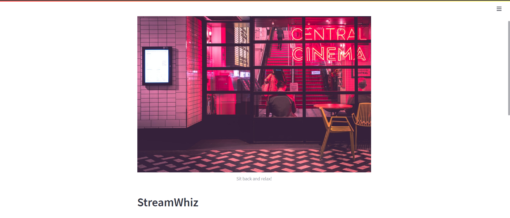
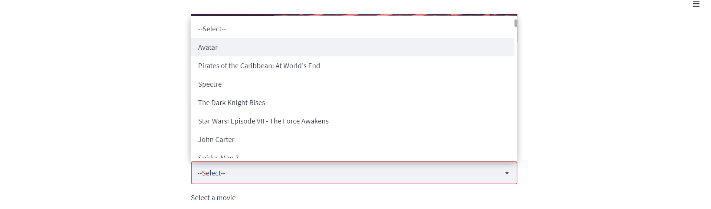
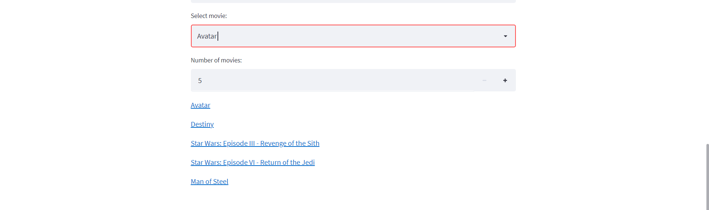
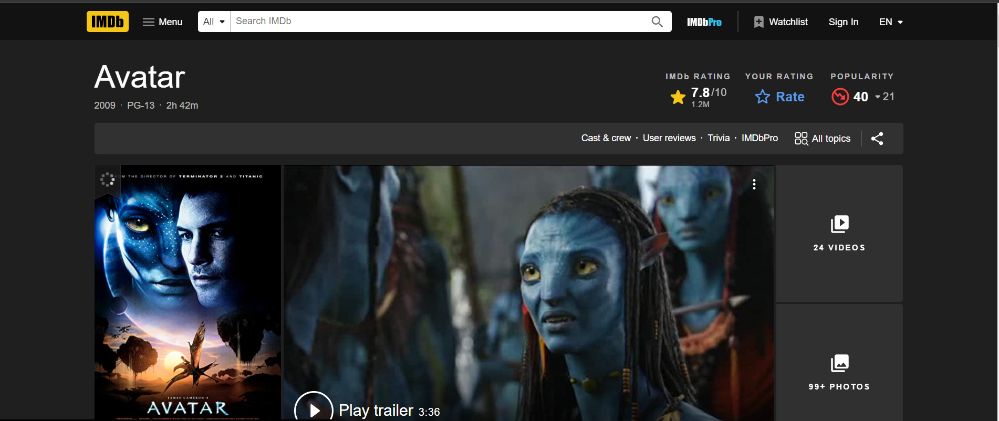
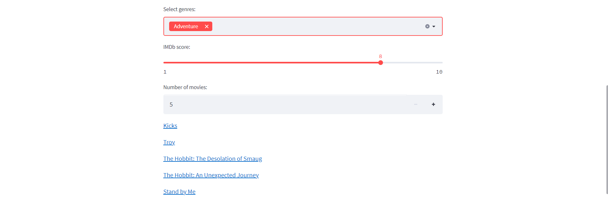
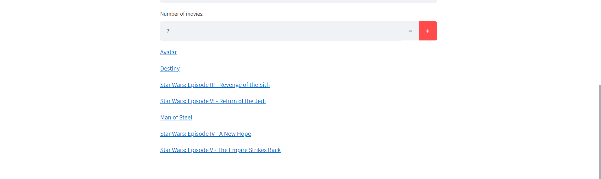

<h1 align="center">StreamWhiz</h1>
<h2 align="center">A Movie Recommendation System</h2>


 <a target="_blank" href="https://www.youtube.com/watch?v=cyso2IBN7VY&ab_channel=SaloniDwivedi">Video Demo</a>
 
<!-- TABLE OF CONTENTS -->
<details open="open">
  <summary>Table of Contents</summary>
  <ol>
    <li><a href="#fun-facts">Fun Facts</a></li>
    <li>
      <a href="#about-the-project">About The Project</a>
      <ul>
        <li><a href="#salient-features">Salient Features</a></li>
        <li><a href="#compatible-platforms">Compatible Platforms</a></li>
        <li><a href="#tech-stack">Tech stack</a></li>
      </ul>
    </li>
      <a href="#getting-started-with-the-idea">Getting Started with the idea</a>
      <ul>
        <li><a href="#prerequisites-and-accessing-the-web-application">Prerequisites and Accessing the Web Application</a></li>
      </ul>
    </li>
    <li><a href="#navigation-through-the-app">Navigation through the app</a></li><ul>
        <li><a href="#working">Working</a></li>
        <li><a href="#movie-based">Movie Based</a></li>
        <li><a href="#genre-based">Genre Based</a></li>
        <li><a href="#additional-features">Additional Features</a></li>
      </ul>
    <li><a href="#comparison-and-analysis">Comparison and Analysis</a></li>
    <li><a href="#resources-used">Resources Used</a></li>
    <li><a href="#resources-used-within-the-web-app">Resources used within the Web App</a></li>
    
  </ol>
</details>


<!--FUN FACTS-->

## Fun Facts
* This mentorship programme was no less than a roller coster ride for me. I learnt a lot of things during this period.
* I also came to know that Netflix(the movie streaming site), once threw an open challenge to make improvements in its recommendation system and win a prize of 1M dollars. Quite huge huh!
* Recommendation engines are becoming time and forth the driving factors for most of the brands and startups out there. 
* Initially, when I chose the project, I tried choosing the best of the methods and algotrithms than can be chosen to make a recommendation engine.
* Over time I realized, that every algorithm out there can be implemented as per our requirements and thus to choose an algorithm which i can make the best use of.
* The I chose to go with Content-based Recommendation system(as I thought I can implement that well) and it is based on the popularity index.
* The dataset I used is available [here](https://www.kaggle.com/datasets/karrrimba/movie-metadatacsv)
* This contained a list of 5043 movies and various details of the movies.


<!-- ABOUT THE PROJECT -->

## About The Project
* This is a movie recommendation engine, a project built during the Microsoft Engage 2022 mentorship programme. 
* This system make use of content based recommendation methods and it gives recommendations on the basis of genres and movie contents. 
* The model used KNN algorithm to determine the similarity in the content of the movies and thus produce relevent recommendations.

### Salient Features
* The user can make choices about the type of content they want to watch.
* There are two categories they can choose upon- Genre based and movie based.
* And yes, the user can also adjust the IMDB ratings of the movies they want to select from.
* Also, and added feature is, the user can adjust the number of movies they want to be recommended to them.

### Compatible Platforms
The app works well with across all the devices and all the operating systems.

### Tech stack

### Python: 
#### Various libraries used for building machine learning models:
* Libraries used - NumPy, Scikit-Learn, Matplotlib, Pandas
* IDEs used - Jupytor, Visual Studio Code

### App and Deployment: 
* App buit using - Streamlit
* Deployment - Heroku


<!-- INSTALLATIONS -->

## Getting Started with the idea
Until the app gets deployed link starts working efficiently, the app can be accessed by:
To run this project on your local systems, the requirements are as follows:

### Prerequisites and Accessing the Web Application
- Download the zip file from the option above.
- Extract the contents on your local machine.
- Install the required dependencies by-
```
pip install streamlit
```
```
pip install numpy
```
- open the terminal from the required directory and type the command-
```
streamlit run app.py
```

<!-- APP TUTORIAL-->
## Navigation through the app

### Working

* After you run the above command, you will be redirected to your browser and you will the see the following:


* You will see an option to select the application


* User can select the mode of recommendation as Movie-based or Genre-based by clicking on the down arrow for 'Select Application'.


#### Movie Based 

* If Movie-based application is selcted, then user needs to enter a movie similar to which the user will get the recommendations.


* There are tons of options of movies of the user to choose from by clicking on the down arrow.



* Then, for the selected movie, recommendations will be provided. The default number of recommendations is set at 5, but you may increase or decrease the number of recommendations as per your requirement.



* The recommendations provided also enables you to check it's overview and it's trailer by clicking on the Movie you choose from the recommendations and you will be directed to its IMDB page. Here, I clicked on Avatar : 



#### Genre Based

* If Genre-based application is selected, then the user needs to select either one or more genres from the options provided.


* Then you may adjust the IMDB score according to your requirement for the recommendations. Here as well, you may increase or decrease the number of recommendations you require.



* You can also increase the number of recommendations :


    
#### Additional Features
  * The features to be added are-
    * A login page which requires the user to make an account and then visit the site.
    * A favourites cart in which you can keep your favourite movies and revisit them when required.
     


<!-- For comparing the three Algorithms -->
## Comparison and Analysis
   - On comparison, Content-based filtering will only give partial results for recommendation while collaborative-based filtering will give many possible results for the user seeking recommendation.
   - But when combining the content-based and collaborative-based filtering together as the Hybrid approch, then the user is getting a very pact solution and convincing recommendations. This is the reason that hybrid approach is being used largely in recommendation systems.
   - Popularity-based filtering is another algorithm type which recommends the most seen or liked items to the user. This is inculcated in the 'Recliner Lounge' Web App as the option to adjust the IMDB Scores. 

<!-- ACKNOWLEDGEMENTS -->

## Resources Used

* [Introduction to recommendation systems](https://towardsdatascience.com/introduction-to-recommender-systems-6c66cf15ada#:~:text=recommendation%20algorithms%20can%20be%20divided,information%20about%20users%20and%2For)
* [Making a recommendation system](https://www.youtube.com/watch?v=_cXm7o9cDRo&ab_channel=KnowledgeShelf)
* [Heroku Deployment](https://www.youtube.com/watch?v=_cXm7o9cDRo&ab_channel=KnowledgeShelf)

## Resources Used within the Web App 

* [Image in the header](https://images.unsplash.com/photo-1536440136628-849c177e76a1?ixlib=rb-1.2.1&ixid=MnwxMjA3fDB8MHxwaG90by1wYWdlfHx8fGVufDB8fHx8&auto=format&fit=crop&w=1025&q=80)


